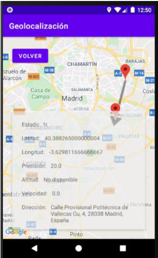

## Descripción 

Este es un portafolio creado en Android Studio con Java y el API de Google para visualizar la ubicación del usuario en el mapa.

## Autor  
**Alejandro Martinez**

* [LinkedIn](https://www.linkedin.com/in/diego-alejandro-martinez-espinosa-571086134)

## Ver ejemplo en vivo 
- 

x2

x3

## Instalación
Este proyecto requiere ser instalado en dispositivos móviles android. 

## Contratación
Si quieres contratarme puedes escribirme a dreamstime@outlook.es para consultas.
